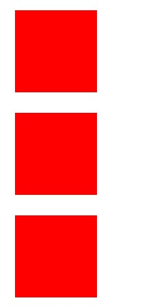
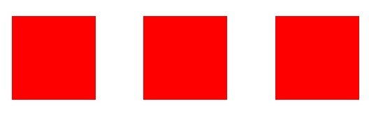
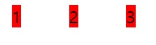
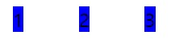
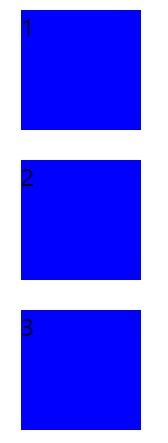
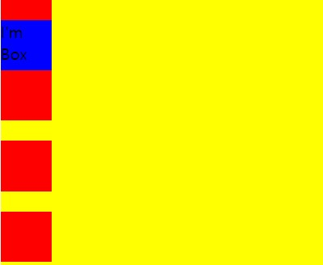

# CSS2

레이아웃 정리 

## 1. display

<html>

```html
<!DOCTYPE html>
<html>
	<head>    
		<meta charset="utf-8">    
		<meta name="viewport" content="width=device-width">    
		<title>CSS2 DEMO</title>
			
	</head>    
	<body> 
	<!--Block_level-->		        
		<div></div> 
		<div></div>        
		<div></div>
	<!--Inline_level-->
		<span></span>
		<span></span>
		<span></span>			
	</body>
		
</html>

```

<css>

```css
div, span{
	width:80px;
	height:80px;
	margin:20px;	
}
```


##  Inline-level & Block-level

- ### Inline

컨텐츠 자체만을 꾸며주는 것 

내용(물건)의 크기에 맞춰 변화한다 

지정되있는 css에서 테그에 width, height 의 정의한 것들이 무시 된다

- ### Inline-block

한 줄에 여러개를 다 넣는데, block(상자)단위 로 변환 되어 안의 컨텐츠의 사이즈와는 상관없이 지정되있는 css 테그에 맞춰 보여지게 된다.


## 1) div 

div는 기본적으로 **Block_level**이어서 css background적용시 **내용 없이도** 바로 보여진다

한줄에 한 개씩 표현된다.

<css>

```css
div{
	background:red;
}
```




이때 display를 사용해서 인라인-블럭(공간안에서 한줄로 나란히)으로 사용할 수 있다.

<css>

```css
div{
	background:red;
	display:inline-block;
}
```




그리고,  인라인만 사용하게 될 경우 span처럼 내용을 써야지만 표현이 된다 

<html>

```html
<!--Block_level-->		        
		<div>1</div> 
		<div>2</div>        
		<div>3</div>
```

<css>

```css
div{
	background:red;
	display:inline;
}
```




## 2) span

span은 기본적으로 **Inline_level**이어서 span는 css background적용시 **내용이 있어야** 보여진다

한줄에 공간이 많으면 여러개가 동시에 표현된다.

<html>

```html
<!--Inline_level-->
		<span>1</span>
		<span>2</span>
		<span>3</span>	
```

<css>

```css
span{
	background:blue;	
} 
```




이때 span에 display를 이용해 div와 같이 한줄에 하나씩 표현할 수도 있다.

<css>

```css
span{
	background:blue;
	display:block;
} 
```




## 2. position

<html>

```html
<!DOCTYPE html>
<html>
	<head>    
		<meta charset="utf-8">    
		<meta name="viewport" content="width=device-width">    
		<title>CSS2 DEMO</title>
			
	</head>    
	<body> 
		<article class="container">
		<div></div>
		<div class="box">I'm Box</div>
		<div></div>
		<div></div>
		<div></div>
		<div></div>
		<div></div>
		<div></div>
		<div></div>	
		
	</body>		
</html>


```

<css>

```css
div{
	width:50px;
	height:50px;
	margin-bottom:20px;
	background:red;
}

.container{
	background: yellow;
}

.box{
	background:blue;
}

```


### 1)container의 position 바꾸기

container 의 콘텐츠의 위치를 바꿔준다.

- position은 Defualt 값으로 **static**을 가지고 있어 left와 top이 적용이 안된 것을 알 수 있다.

<css>

```css
.container{
	background: yellow;
	left:20px;
	top:20px;
	position:static;
}
```


-  **relative** 해주면 왼쪽과 위쪽에 20px씩 적용된 것 적용된다. 

<css>

```css
.container{
	background: yellow;
	left:20px;
	top:20px;
	position:relative;
}
```


### 2) box의 position 바꾸기 

심화 : 이번엔 박스의 위치를 이동시켜보자!!

* **relative**는 원래 있던 자리에서 상대적으로 이동한다.

<css>

```css
.box{
	background:blue;
	left:20px;
	top:20px;
	position:relative;
}
```


* **absolute**는 아이템이 담겨있는  상자 안에서 위치변경이 일어난다.

<css> 

```css
.box{
	background:blue;
	left:20px;
	top:20px;
	position:absolute;
}
```


* **fixed** 는 상자안에서 완전히 벗어나서 윈도우 안에서 움직인다. 웹페이지 안에서 움직인 것이다.

<css>

```css
.box{
	background:blue;
	left:20px;
	top:20px;
	position:fixed;
}
```


* **sticky**는 본인자리 고정. 다른것이 움직여도 고정된 본인은 안움직인다.

<css>

```css
.box{
	background:blue;
	left:20px;
	top:20px;
	position:sticky;
}
```




[출처](https://youtu.be/jWh3IbgMUPI) 드림코딩by엘리 : CSS 레이아웃 정리 display, position 완성

