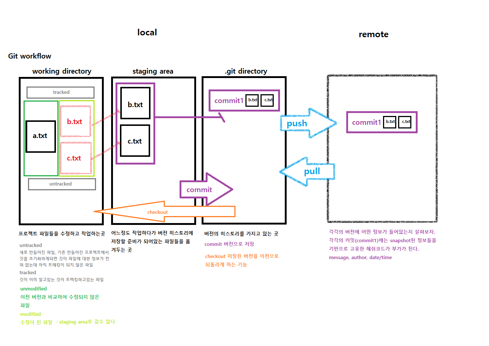

# Git Github

all the commands (original)

## Set up

[git 공식 사이트](https://git-scm.com/)명령어를 기본으로한 명령어 프로그램


[Sourcetree 공식 사이트](https://www.sourcetreeapp.com/) github에 호스팅 하는 어플리케이션


외에도 GitKraken , GithubDesktop 등 이 있다.


Commend 창

* iTerm2 (MAC)

* cmd (Window + R)

* 윈도우 cmdR 을 설치하면 GIT도 함께 설치되기 때문에 따로 설치 할 필요가 없다. 


Window cmd

```
깃버전 확인하기:
git --version

깃의 모든 설정들을 볼 수 있음:
git config --list

파일로 열어보고 싶을때:
git config --global -e

텍스트 에디터로 연결(VSCODE)-운영체제에 맞춰하기:

1. .gitconfig file이 열림과 동시에 cmd에서 다른 명령어 수행할 수 있도록 활성화 되있다.
git config --global core.editor "code"
git config --global -e

2. .gitconfig file이 종료되기 이전에는 cmd에서 다른 명령어를 수행할 수 없다.
git config --global core.editor "code --wait"
git config --global -e

현제 디랙토리가 VSCODE로 열어지게 됨:
code . 

사용자 설정:
git config --global user.name "Ginttone"
git config --global user.email "ginttone@ .com"
설정 확인:
git config user.name
git config user.email

깃에 저장할때 carriage-return \n(in feed)을 auto로 맞춰준다(윈도우와 맥이 다르기 때문)
* 윈도우 사용자는 true:
git config --global core.autocrlf true
* 맥 사용자는 input:
git config --global core.autocrlf input
```


[Commend](https://git-scm.com/docs)

```
깃  명령어   옵션
git config 
git commit
git add     -option
```


자주 쓰는 명령어

터미널 명령어

```
cd path주소를 붙히면 그 위치로 간다.
 cd c:\원하는위치

mkdir 디랙토리를 생성한다.
 mkdir 생성하고싶은이름

ls 현 디렉토리에 무엇이있는지 알수 있다.
 ls -al

open .폴더를 열때 쓸 수 있다.
 open .폴더이름
 
컨트롤 + k 를 누르면 터미널이 깨끗하게 지워진다. 
```


git은 어떤 folder 든지 초기화해서 사용이 가능하다.

```
mkdir git 깃 디렉토리생성
cd git 깃 디렉토리로 이동
ls -al 깃 디렉토리안에 무엇이있는지 전체확인
git init 깃 초기화
ls -al 확인 했을때 .git이 있으면 숨겨진 파일로 본다. 이것을 열때는
open .git 오픈 .폴더이름 을 입력한다.
깃을 초기화하게되면 기본적으로 master branch가 생긴다 
rm -rf .git 깃을 제거하고싶을때 쓰는 명령어
git status 깃의 상태를 확인할 수 있다.
git config --global alias.st status 반복되는 명령어를 단축해서 쓰고싶을때(status == st)

```



## Basics

file만들기

```
     문자열을  a.txt파일에 저장한다.
echo hello world! > a.txt
터미널에서는 방향키 위 버튼을 누르면 이전에 작성한 것을 다시 활용할 수 있다.
ls 누르면 만들어진 파일들을 확인 할 수 있다. 
git status 상태를 확인 가능하다.
git add a.txt 언트렉 된 a.txt을 스테이징 에리아로 이동시킬 수 있다.
git add *.txt 존재하는 txt파일을 모두 추가하고싶을땐 *.txt 사용하면 된다.
echo ginttone >> a.txt 새로운 문자열을 a.txt에 추가하고 싶을때 사용.
이때 수정된 a.txt는 트렉위치에 존재한다 그래서 
git add a.txt 를 해주어 스테이징에리아로 이동해준다. 
git rm --cashed * 이 명령어는 스테이징에리아에있는 모든파일을 언트렉트 부분으로 옮겨준다.
git add * 디렉토리에 있는 모든 파일들 스테이징에리아로 옮겨진다.그렇지만, 파일중 삭제 된 파일은 디렉토리에 없었기 때문에 옮겨지지 않는다. 
rm a.txt 하게되면 a.txt파일이 삭제된다. 
git add . 모든 파일들을 포함해서 깃 스테이징 에리아에 추가된다. 
```


.gitignore 트레킹하고 싶지 않은 파일이나, 깃 혹은 깃헙에 올리기 싶지 않은 파일들은 여기에 추가해서 쓸수 있다.

```
echo *.log > .gitignore 전체파일중에 확장자가 'log'인것을 추가하고싶지 않을 때. 깃이그노어에 추가하는방법
echo log.log > .gitignore 로그파일 하나만 올리고 싶지 않을때
build/ 특정한 디랙토리(build) 안에 있는 파일들은 올리고 싶지 않을때
build/.log 특정한 디렉토리(build) 안에 있는 로그 파일을 올리고 싶지 않을때 
build/*.log 특정한 디렉토리(build)안에 있는 모든 확장자 'log'파일을 올리고 싶지 않을때
```


git status -h 깃 상태에 대해 좀더 자세히 알고 싶을때 쓴다.

```
git status 의 디폴트 값은 --long 이다.상세정보를 알 수 있다.
git status -s 간단하게 확인가능
git status -b 브렌치 관련 정보들를 알고 싶을때 
```


#### git diff 정확하게 워킹디렉토리 안에 어떤 파일의 내용이 수정되었는지 확인할 때 쓴다.

```
diff --git a/c.txt b/c.txt   --> 깃커맨드를 이용해 이전버전 a/과 지금버전b/를 비교한다.
index a042389..f5be8ac 100644
--- a/c.txt                  
+++ b/c.txt                  
@@ -1,+1,2@@                 --> -은 이전버전의 1줄 을 확인해준다 hello world! 
hello world!                 --> +은 지금버전의 1줄에서2줄까지 확인해. hello world! +add
+add                         --> 추가되면 +초록색으로, 삭제되면 -빨강으로 표기됨
(END)
```

* 키보드 	q	누르면 종료된다.

* cat c.txt 파일의 내용을 확인가능하다.


git diff --staged 스테이징에리아에 있는 정보를 확인할 수 있다.

git diff -h 디프 관련해서 사용할수 있는 옵션들을 확인가능하다.


#### 위의 사항을 아래와 같이 원하는 UI와 연결해서 변결된 테크트리를 확인할수도 있다.

git config --global -e 내가 원하는 UI와 연결할 때 이때 VSCODE로 .gitconfig가 열리게 되늰데, 여기에 아래를 추가한다. 

```
[pull]
rebase=false
[diff]
tool= vscode
[difftool "vscode"]
cmd= code --wait --diff $LOCAL $REMOTE
```

git difftool 입력하면 vscode로 실행하겠습니까? Y/N나온다. 이때 Y하면 VSCODE로 열어 사용이 가능하다. 


#### commit 메세지 작성

Title 과 Description을 작성해준다. 

```
git commit 커밋 확인
git log 히스토리 확인
git commit -m "커밋메시지입력" 
git commit -am "커밋메시지입력" 스테이징에리아에있는 전체 파일들과 내용들을 메세지와함께 커밋해달라.
```


보통 히스토리에 커밋하는 순서(의미있는 단위로 현재형 동사로 만들어진다.)

```
6.Add light theme
5.Add about page
4.Add Welcome page
3.Add UserRepository module 유저 리포지토리 모듈을 만들고서 커밋
2.Add LoginService module 로그인 서비스 모듈을 만들고서 커밋
1.Initialise project 프로젝트를 초기화 하는 커밋
```

커밋할때 Fix crashing on login module 을 했을때, 

버그도 고치고 리팩토링도하고 새로운 것도 넣어볼까 하고 모두 수정하고서 커밋을 하면 안된다. 

커밋메세지에 맞게 해당내용만 커밋하는 것을 권장한다.


[출처 드림코딩by엘리](https://youtu.be/Z9dvM7qgN9s) 깃, 깃허브 제대로 배우기

