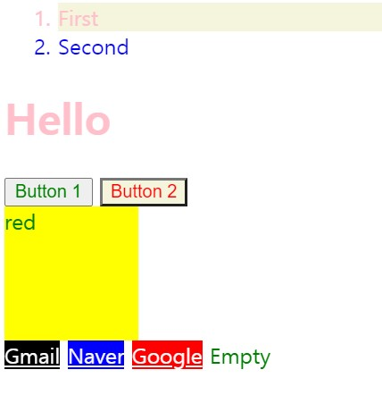
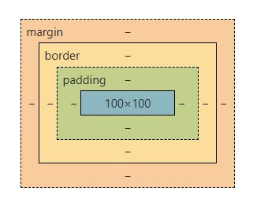
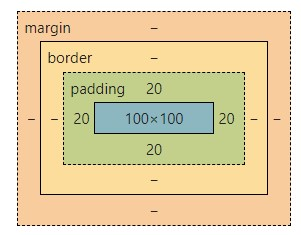
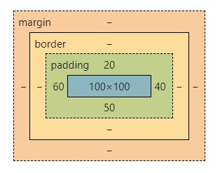
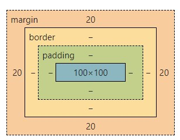
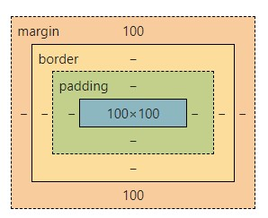
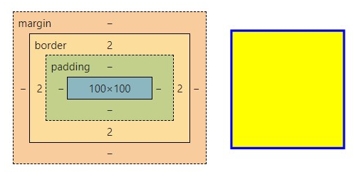
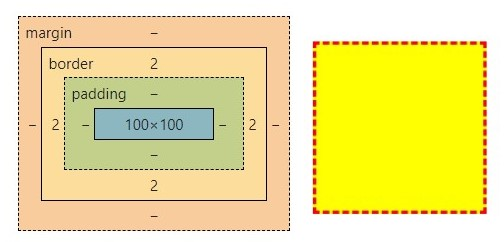

# CSS[Reference](https://developer.mozilla.org/en-US/docs/Web/CSS/Reference)

## Selector 1

<html>

```html
<!DOCTYPE html>
<html>
<head>
	<meta charset="utf-8">
	<meta name="viewport" content="width=">
	<title>CSS DEMO</title>
</head>
	<body>
		<ol>
			<li id="special">First</li>
			<li>Second</li>
		</ol>
		<h1 id="special">Hello</h1>
		<button>Button 1</button>
		<button>Button 2</button>
		<div class="red">red</div>
		<div class="blue"></div>
		<a href="gmail.co">Gmail</a>
		<a href="naver.co">Naver</a>
		<a href="googlenaver.com">Google</a>
		<a>Empty</a>
	</body>
</html>


```

<css>

```css
/*
selector{
	property: value;
}
*/
* {
	color:green;	
} /* 모든테그선택 */
li {
	color:blue;
} /* 지정테그선택 */
#special{
	color:pink;
}/* 해당아이디special선택 */

li#special{
	color:pink;
	background:beige;
}/* li테그에 들어있는 해당아이디 special  바꾸고싶어 */

.red{
	width:100px;
	height:100px;
	background: yellow;
}/* 해당클래스선택
div는 기본으로 한블럭을 모두 차지한다
width로 너비지정, height로 높이지정*/

button:hover{
	color:red;
	background:beige;
}
/*스테이트 셀렉트는 같은 버튼이어도 버튼위에 마우스를 올렸을 상태*/

a[href]{
	color:purple;
}
/*속성값만 바꾸고싶을때*/

a[href="gmail.co"]{
	color:white;
	background:black;
}
/*속성값이 gmail.com인 것만 바꾸고싶을때*/

a[href^="naver"]{
	color:white;
	background:blue;
}
/*속성값에서 앞에naver들어있는 것만 바꾸고싶을때*/

a[href$=".com"]{
	color:white;
	background:red;
}
/*속성값에서 .com으로 끝나는 것만 바꾸고싶을때*/
```



## Selector 2

<html>

```html
<!DOCTYPE html>
<html>
<head>
	<meta charset="utf-8">
	<meta name="viewport" content="width=">
	<title>CSS DEMO</title>
</head>
	<body>
		<div class="red"></div>
		<div class="blue"></div>
	</body>
</html>
```


<css>

```css
.red{
	width:100px;
	height:100px;
	background: yellow;
}
```



### 1.padding

<css>  : in content (콘텐츠 내부 사이즈조절)

```css
.red{
	width:100px;
	height:100px;
	padding:20px;
	background: yellow;
}
```



```css
/*상 우 하 좌 선택해서 지정*/
padding-top:100px;
padding-right:100px;
padding-bottom:100px;
padding-left:100px;

/*좌 우 지정*/
padding: 0px 20px;

/*상 하 지정*/
padding: 20px 0px;

/*시계방향으로 나열가능*/
padding:20px 40px 50px 60px;
```




### 2.margin

<css> : outside the content (콘텐츠 밖의 사이즈 조절)

```css
.red{
	width:100px;
	height:100px;
	margin:20px;
	background: yellow;
}
```



```css
/*상 우 하 좌 선택해서 지정*/
margin-top:100px;
margin-right:100px;
margin-bottom:100px;
margin-left:100px;

/*시계방향으로 나열가능*/
margin:20px 40px 50px 60px;

/*좌 우 지정*/
margin: 0px 100px;

/*상 하 지정*/
margin: 100px 0px;
```




### 3.border

<css>

```css
.red{
	width:100px;
	height:100px;
	border-width: 2px;
	border-style: solid;
	border-color: blue;
	background: yellow;
}
```




```css
/*사이즈 라인스타일 색상*/
border: 2px dashed red;
```



[출처](https://youtu.be/gGebK7lWnCk) 드림코딩 by 엘리 : CSS 셀렉터, 기초 이론 정리

[Css game](https://flukeout.github.io/)

