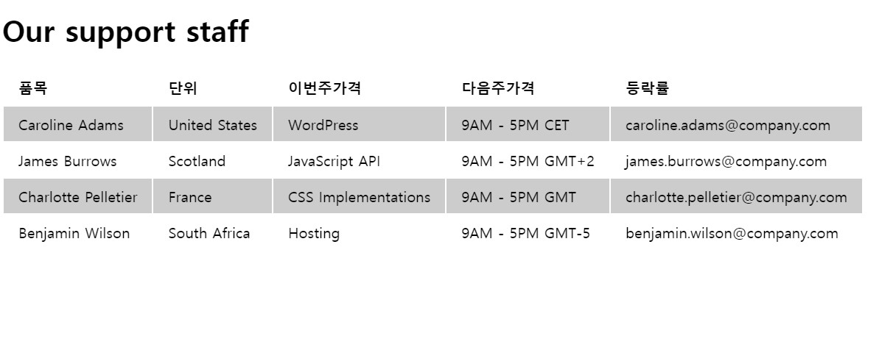
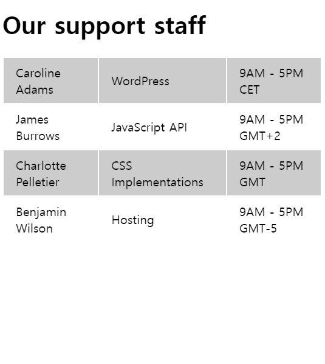
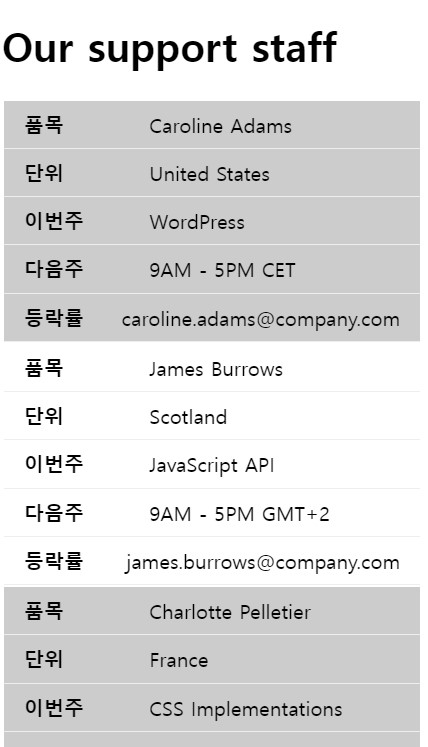

# :game_die:Table_1

- 화면반응형 테이블(창이 작아지면 단위 부분 안보이게)

<html>

```html
<h1>Our support staff</h1>
<div class="wrapper">
	<table>
	<thead>
		<tr>
			<th>품목</th>
			<th>단위</th>
			<th>이전주</th>
			<th>다음주</th>
			<th>등락률</th>
		</tr>
	</thead>
	<tbody>
		<tr>
			<td>Caroline Adams</td>
			<td>United States</td>
			<td>WordPress</td>
			<td>WordPress</td>
			<td>WordPress</td>
		</tr>
		<tr>
			<td>James Burrows</td>
			<td>Scotland</td>
			<td>JavaScript API</td>
			<td>JavaScript API</td>
			<td>WordPress</td>
		</tr>
		<tr>
			<td>Charlotte Pelletier</td>
			<td>France</td>
			<td>CSS Implementations</td>
			<td>CSS Implementations</td>
			<td>WordPress</td>
		</tr>
		<tr>
			<td>Benjamin Wilson</td>
			<td>South Africa</td>
			<td>Hosting</td>
			<td>Hosting</td>
			<td>WordPress</td>
		</tr>
	</tbody>
</table>
</div>

```


<css>

```css
/* Demo styles. */
td, th {
	text-align: left;
	padding: .5rem 1rem;
}

tbody tr:nth-child(odd) {
	background-color: #ccc;
}

.wrapper{
	overflow:auto;
	max-width:100%;
	width:100%;
	border:1
}

.wrapper table{
	width:100%;
}

@media screen and (max-width:768px){
	th:nth-last-child(4), td:nth-last-child(4){
		display:none;
	}
}
```


# Table_1응용

<html>

```html
<div class="next-week-list-table">
	<div class="next-week-table">
	<table>
		<thead>
			<tr>
				<th>품목</th>
				<th>단위</th>
				<th>이전주</th>
				<th>다음주</th>
				<th>등락률</th>
			</tr>
		</thead>
		<tbody>
			<tr>
				<td>Caroline Adams</td>
				<td>United States</td>
				<td>WordPress</td>
				<td>WordPress</td>
				<td>WordPress</td>
			</tr>
			<tr>
				<td>James Burrows</td>
				<td>Scotland</td>
				<td>JavaScript API</td>
				<td>JavaScript API</td>
				<td>WordPress</td>
			</tr>
			<tr>
				<td>Charlotte Pelletier</td>
				<td>France</td>
				<td>CSS Implementations</td>
				<td>CSS Implementations</td>
				<td>WordPress</td>
			</tr>
			<tr>
				<td>Benjamin Wilson</td>
				<td>South Africa</td>
				<td>Hosting</td>
				<td>Hosting</td>
				<td>WordPress</td>
			</tr>
		</tbody>
	 </table>		
	</div>
</div>
```


<css>

```css
/* Demo styles. */
td, th {
	text-align: left;
	padding: .5rem 1rem;
}

tbody tr:nth-child(odd) {
	background-color: #ccc;
}

.next-week-table{
	overflow:auto;
	max-width:100%;
	width:100%;
	border:1
}

.next-week-table table{
	width:100%;
}

@media screen and (max-width:768px){
	th:nth-last-child(4), td:nth-last-child(4){
		display:none;
	}
}
```


# :game_die:Table_2 

- 사이즈별로 삭제 및 틀 다르게 보이게 만들기

<html>

```html
<h1>Our support staff</h1>

<div class="wrapper">
	<table>
		<thead>
			<tr>
				<th>품목</th>
				<th>단위</th>
				<th>이번주가격</th>
				<th>다음주가격</th>
				<th>등락률</th>
			</tr>
		</thead>
		<tbody>
			<tr>
				<td>Caroline Adams</td>
				<td>United States</td>
				<td>WordPress</td>
				<td>9AM - 5PM CET</td>
				<td>caroline.adams@company.com</td>
			</tr>
			<tr>
				<td>James Burrows</td>
				<td>Scotland</td>
				<td>JavaScript API</td>
				<td>9AM - 5PM GMT+2</td>
				<td>james.burrows@company.com</td>
			</tr>
			<tr>
				<td>Charlotte Pelletier</td>
				<td>France</td>
				<td>CSS Implementations</td>
				<td>9AM - 5PM GMT</td>
				<td>charlotte.pelletier@company.com</td>
			</tr>
			<tr>
				<td>Benjamin Wilson</td>
				<td>South Africa</td>
				<td>Hosting</td>
				<td>9AM - 5PM GMT-5</td>
				<td>benjamin.wilson@company.com</td>
			</tr>
		</tbody>
	</table>
</div>
```

<css>

```css
/* Demo styles. */
td, th {
	text-align: left;
	padding: .5rem 1rem;
}

tbody tr:nth-child(odd) {
	background-color: #ccc;
}

@media screen and (max-width:768px){
	th:last-child,td:last-child{
		display:none;
	}}

@media screen and (max-width:480px){
	th:nth-child(2),td:nth-child(2){
		display:none;
	}
	thead{
		display:none;
	}
}


@media screen and (max-width:400px){
	table{width:100%;}
	th, td{display:block !important;}
	td{border-bottom:1px solid #eee; display:grid !important; grid-template-columns:1fr 2fr;}
	td:before{font-weight:bold;}
	td:nth-of-type(1):before{content:'품목';}
	td:nth-of-type(2):before{content:'단위';}
	td:nth-of-type(3):before{content:'이번주';}
	td:nth-of-type(4):before{content:'다음주';}
	td:nth-of-type(5):before{content:'등락률';}	
	
}
```




<css>

```css
/* Demo styles. */
td, th {
	text-align: left;
	padding: .5rem 1rem;
}

tbody tr:nth-child(odd) {
	background-color: #ccc;
}

@media screen and (max-width:768px){
	th:last-child,td:last-child{
		display:none;
	}}
```


```css

@media screen and (max-width:480px){
	th:nth-child(2),td:nth-child(2){
		display:none;
	}
	thead{
		display:none;
	}
}
```



```css
@media screen and (max-width:400px){
	table{width:100%;}
	th, td{display:block !important;}
	td{border-bottom:1px solid #eee; display:grid !important; grid-template-columns:1fr 2fr;}
	td:before{font-weight:bold;}
	td:nth-of-type(1):before{content:'품목';}
	td:nth-of-type(2):before{content:'단위';}
	td:nth-of-type(3):before{content:'이번주';}
	td:nth-of-type(4):before{content:'다음주';}
	td:nth-of-type(5):before{content:'등락률';}
	
}
```




<html> table_2 의 td속성에 값 부여해 

```html
<tr>
    <td data-title="이름">Adams</td>
    <td data-title="주소">United States</td>
    <td data-title="일">WordPress</td>
    <td data-title="시간">9AM - 5PM CET</td>
    <td data-title="메일">caroline.adams@company.com</td>
</tr>
```

<css> css @media부분 attr 사용도 가능 

```css
@media screen and (max-width:400px){
	table{width:100%;}
	th, td{display:block !important;}
	td{border-bottom:1px solid #eee; display:grid !important; grid-template-columns:1fr 2fr;}
	td:before{font-weight:bold;}
	td:nth-of-type(1):before{content:attr(data-title);}
    td:nth-of-type(2):before{content:attr(data-title);}
    td:nth-of-type(3):before{content:attr(data-title);}
    td:nth-of-type(4):before{content:attr(data-title);}
    td:nth-of-type(5):before{content:attr(data-title);}
}
```


# :game_die:Table_3

- 페이지 네이션

<html>

```html
<div class="pagination">
	<ol id="numbers">
<!-- 		<li><a href="">1</a></li>
		<li><a href="">2</a></li>
		<li><a href="">3</a></li> -->
	</ol>
</div>

<table id="my-table">
	<thead>
		<tr>
			<th>ID</th>
			<th>Name</th>
			<th>Date of Birth</th>
			<th>Address</th>
			<th>Country</th>
			<th>Experience</th>
		</tr>
	</thead>
	<tbody>
		<tr>
			<td>1</td>
			<td>Kyle P. Fleming</td>
			<td>March 14th, 2019</td>
			<td>Ap #838-8378 Pharetra Rd.</td>
			<td>Japan</td>
			<td>22</td>
		</tr>
	</tbody>
</table>
```


<css>

```css
/* Table styles. */
td,
th {
	text-align: left;
	padding: .5rem 1rem;
}

tbody tr:nth-child(odd) {
	background-color: #ccc;
}

th {
	background: #444;
	color: #fff;
}

/* Pagination. */
.pagination {
	background: #333;
	padding: 1rem;
	margin-bottom: 1rem;
	text-align: center;
	display: flex;
	justify-content: center;
}

#numbers {
	padding: 0;
	margin: 0 2rem;
	list-style-type: none;
	display: flex;
}

#numbers li a {
	color: #fff;
	padding: .5rem 1rem;
	text-decoration: none;
	opacity: .7;
}

#numbers li a:hover {
	opacity: 1;
}

#numbers li a.active {
	opacity: 1;
	background: #fff;
	color: #333;
}
```


<js> jQuery로 Pagenation function 만들기 

```js
$(function(){
	/*
	변수생성 
	- rowsPerPage페이지당 보여질 개수 20
	- rows 가로행의 tr 
	- rowsCount 가로행의 tr 개수 
	- pageCount 페이지네이션 개수 = 100/20
	- numbers ol에 있는 #numbers도 변수로 
	콘솔에서 pageCount 찍어 확인
	*/
	var rowPerPage = 15, <----페이지마다 몇개 뿌릴거야
		rows = $('#my-table tbody tr'), <----이 줄을 가져올거야  100개의tr
		rowsCount = rows.length, 
		pageCount = Math.cell(rowsCount/rowsPerPage),
		numbers= $('#numbers');
	consol.log(pageCount) <----체크해봣어
	
	/* 페이지네이션 li 를 생성 반복문*/
	for(초기값; 끝조건; 초기값 증감){
		numbers.append(<li><a href="">1</a></li>) <----실제로 할일
	}
    
    //페이지 네이션 함수 displayRows
	function displayRows(idx){
		var start = (idx-1)*rowsPerPage;
			end = start + rowsPerPage;
	}
});

/*
1페이지 1~20
2페이지 21~40
3페이지 41~60
...

함수(숫자)
A.slice(시작값, 끝값)
A.slice(0,10)
A.slice(10,20)
...

.show()
*/

```

<js>

```js
$(function(){
	var rowPerPage = 20,
		rows = $('#my-table tbody tr'),
		rowsCount = rows.length,
		pageCount = Math.cell(rowsCount/rowsPerPage),
		numbers= $('#numbers');
	
	for(var i = 1; i<= pageCount; i++){
		numbers.append('<li><a href="">'+ i +'</a></li>')	
	}
	numbers.find('#numbers li:first-child a').addClass('active');
	//페이지 네이션 함수 displayRows
	function displayRows(idx){
		var start = (idx-1)*rowsPerPage;
			end = start + rowsPerPage;
		rows.hide();
		rows.slide(start, end).show();
	}
	displayRows(1);
	//페이지네이션 클릭시 보여주기
	/*
		클릭한 그 a tag에 active 추가,
		클릭한 그 요소에 숫자를 받아 displayRows에 매개변수 지정,
	*/
	numbers.find('li').click(function(e){
		e.preventDefault();
		numbers.find('li a').removeClass('active');
		$(this).find('a').addClass('active');
		var index=$(this).index() + 1;		
		displayRows(index);
	});
	
});
```

<js> 완성 

```js
$(function(){
	var rowPerPage = 20,
		rows = $('#my-table tbody tr'),
		rowsCount = rows.length,
		pageCount = Math.cell(rowsCount/rowsPerPage),
		numbers= $('#numbers');
	
	for(var i = 1; i<= pageCount; i++){
		numbers.append('<li><a href="">'+ i +'</a></li>')	
	}
	numbers.find('#numbers li:first-child a').addClass('active');
	//페이지 네이션 함수 displayRows
	function displayRows(idx){
		var start = (idx-1)*rowsPerPage;
			end = start + rowsPerPage;
		rows.hide();
		rows.slide(start, end).show();
	}
	displayRows(1);
	//페이지네이션 클릭시 보여주기
	/*
		클릭한 그 a tag에 active 추가,
		클릭한 그 요소에 숫자를 받아 displayRows에 매개변수 지정,
	*/
	numbers.find('li a').click(function(e){
		e.preventDefault();
		numbers.find('li a').removeClass('active');
		$(this).addClass('active');
		var index = $(this).text();		
		displayRows(index);
	});
	
});
```


# :game_die:Table_4

* 정렬

```
패키지 다운
npm install tablesort 

<script src='tablesort.min.js'></script>

<!-- Include sort types you need -->
<script src='tablesort.number.js'></script>
<script src='tablesort.date.js'></script>

<script>
  new Tablesort(document.getElementById('table-id'));
</script>

https://s3-us-west-2.amazonaws.com/s.cdpn.io/17119/tablesort.min.js
https://s3-us-west-2.amazonaws.com/s.cdpn.io/17119/tablesort.number.min.js
https://cdnjs.cloudflare.com/ajax/libs/datejs/1.0/date.min.js
```


<html>

```html
<table id="my-table">
	<thead>
		<tr>
			<th>ID</th>
			<th>Name</th>
			<th>Address</th>
			<th>Country</th>
			<th>Experience</th>
		</tr>
	</thead>
	<tbody>
		<tr>
			<td>1</td>
			<td>Kyle P. Fleming</td>
			<td>Ap #838-8378 Pharetra Rd.</td>
			<td>Japan</td>
			<td>22</td>
		</tr>
		<tr>
			<td>2</td>
			<td>Dora S. Valenzuela</td>
			<td>457-4255 Velit. Rd.</td>
			<td>Lesotho</td>
			<td>13</td>
		</tr>
		<tr>
			<td>3</td>
			<td>Tara X. Humphrey</td>
			<td>P.O. Box 902, 8389 Interdum. Road</td>
			<td>Nauru</td>
			<td>3</td>
		</tr>
		<tr>
			<td>4</td>
			<td>Jade A. Frazier</td>
			<td>1883 Metus. Ave</td>
			<td>French Polynesia</td>
			<td>25</td>
		</tr>
		<tr>
			<td>5</td>
			<td>Frances Q. Steele</td>
			<td>4139 Senectus Rd.</td>
			<td>Trinidad and Tobago</td>
			<td>27</td>
		</tr>
		<tr>
			<td>6</td>
			<td>Lacota H. Hernandez</td>
			<td>610-3617 Tellus St.</td>
			<td>Bahamas</td>
			<td>6</td>
		</tr>
		<tr>
			<td>7</td>
			<td>Blaze I. Mcgee</td>
			<td>Ap #996-7968 Mi Avenue</td>
			<td>Zambia</td>
			<td>20</td>
		</tr>
		<tr>
			<td>8</td>
			<td>Carson N. Stevenson</td>
			<td>183-5258 Vel, Road</td>
			<td>Philippines</td>
			<td>5</td>
		</tr>
		<tr>
			<td>9</td>
			<td>Rashad V. Perry</td>
			<td>Ap #978-7382 Lobortis. St.</td>
			<td>Philippines</td>
			<td>29</td>
		</tr>
		<tr>
			<td>10</td>
			<td>Isabella V. Wright</td>
			<td>Ap #142-4168 Augue Road</td>
			<td>Italy</td>
			<td>3</td>
		</tr>
		<tr>
			<td>11</td>
			<td>Xander B. Hoover</td>
			<td>6120 Suspendisse Ave</td>
			<td>Maldives</td>
			<td>21</td>
		</tr>
		<tr>
			<td>12</td>
			<td>Mona J. Saunders</td>
			<td>Ap #908-2496 Mus. Rd.</td>
			<td>Iceland</td>
			<td>13</td>
		</tr>
		<tr>
			<td>13</td>
			<td>Ralph R. Ingram</td>
			<td>788-8864 Fames Street</td>
			<td>Netherlands</td>
			<td>2</td>
		</tr>
		<tr>
			<td>14</td>
			<td>Lewis H. Lane</td>
			<td>P.O. Box 377, 9903 Lectus Rd.</td>
			<td>Palestine, State of</td>
			<td>1</td>
		</tr>
		<tr>
			<td>15</td>
			<td>Ivory A. Fowler</td>
			<td>Ap #947-9930 Magna. Road</td>
			<td>Western Sahara</td>
			<td>2</td>
		</tr>
		<tr>
			<td>16</td>
			<td>Addison U. Vargas</td>
			<td>Ap #554-1800 Ac Avenue</td>
			<td>Tunisia</td>
			<td>25</td>
		</tr>
		<tr>
			<td>17</td>
			<td>Kadeem N. Beard</td>
			<td>P.O. Box 929, 5513 Rhoncus Road</td>
			<td>Bonaire, Sint Eustatius and Saba</td>
			<td>3</td>
		</tr>
		<tr>
			<td>18</td>
			<td>Ima G. Mathis</td>
			<td>P.O. Box 182, 6197 Nulla. Rd.</td>
			<td>American Samoa</td>
			<td>27</td>
		</tr>
		<tr>
			<td>19</td>
			<td>Armando W. Pickett</td>
			<td>348-3397 Morbi Road</td>
			<td>Gabon</td>
			<td>23</td>
		</tr>
		<tr>
			<td>20</td>
			<td>Aileen K. Molina</td>
			<td>612-1791 Auctor St.</td>
			<td>Poland</td>
			<td>15</td>
		</tr>
		<tr>
			<td>21</td>
			<td>Halee U. Sandoval</td>
			<td>P.O. Box 507, 6332 Nec, St.</td>
			<td>Germany</td>
			<td>25</td>
		</tr>
		<tr>
			<td>22</td>
			<td>Julie Y. Wilkinson</td>
			<td>158-8182 Non, Av.</td>
			<td>Solomon Islands</td>
			<td>20</td>
		</tr>
		<tr>
			<td>23</td>
			<td>Jillian T. Ellis</td>
			<td>571-4676 Orci, St.</td>
			<td>French Guiana</td>
			<td>25</td>
		</tr>
		<tr>
			<td>24</td>
			<td>Nathan D. Richards</td>
			<td>398-6894 Vel Street</td>
			<td>French Southern Territories</td>
			<td>11</td>
		</tr>
		<tr>
			<td>25</td>
			<td>Marvin Y. Rutledge</td>
			<td>1661 Tincidunt, Street</td>
			<td>Portugal</td>
			<td>20</td>
		</tr>
	</tbody>
</table>
```


<css>

```css
/* Table styles. */
td,
th {
	text-align: left;
	padding: .5rem 1rem;
}

tbody tr:nth-child(odd) {
	background-color: #ccc;
}

th {
	background: #444;
	color: #fff;
}

/* Sorting. icon */
th[role=columnheader]:not(.no-sort) {
	cursor: pointer;
}

th[role=columnheader]:not(.no-sort):after {
	content: '';
	float: right;
	margin-top: 7px;
	border-width: 0 4px 4px;
	border-style: solid;
	border-color: #ccc transparent;
	visibility: hidden;
	opacity: 0;
	-ms-user-select: none;
	-webkit-user-select: none;
	-moz-user-select: none;
	user-select: none;
}

th[aria-sort=ascending]:not(.no-sort):after {
	border-bottom: none;
	border-width: 4px 4px 0;
}

th[aria-sort]:not(.no-sort):after {
	visibility: visible;
	opacity: 0.4;
}

th[role=columnheader]:not(.no-sort):hover:after {
	visibility: visible;
	opacity: 1;
}
```


<js>

```js
 new Tablesort(document.getElementById('my-table'));
```


## Tabel_4 응용

<html>

```html
<table id="my-table">
	<thead>
		<tr>
			<th>순위</th>
			<th>품명</th>
			<th>이번주</th>
			<th>다음주</th>
			<th>등락률</th>
		</tr>
	</thead>
	<tbody>
		<tr>
			<td>1</td>
			<td>Kyle P. Fleming</td>
			<td>Ap #838-8378 Pharetra Rd.</td>
			<td>Japan</td>
			<td>22</td>
		</tr>
		<tr>
			<td>2</td>
			<td>Dora S. Valenzuela</td>
			<td>457-4255 Velit. Rd.</td>
			<td>Lesotho</td>
			<td>13</td>
		</tr>
		<tr>
			<td>3</td>
			<td>Tara X. Humphrey</td>
			<td>P.O. Box 902, 8389 Interdum. Road</td>
			<td>Nauru</td>
			<td>3</td>
		</tr>
		<tr>
			<td>4</td>
			<td>Jade A. Frazier</td>
			<td>1883 Metus. Ave</td>
			<td>French Polynesia</td>
			<td>25</td>
		</tr>
		<tr>
			<td>5</td>
			<td>Frances Q. Steele</td>
			<td>4139 Senectus Rd.</td>
			<td>Trinidad and Tobago</td>
			<td>27</td>
		</tr>
		<tr>
			<td>6</td>
			<td>Lacota H. Hernandez</td>
			<td>610-3617 Tellus St.</td>
			<td>Bahamas</td>
			<td>6</td>
		</tr>
		<tr>
			<td>7</td>
			<td>Blaze I. Mcgee</td>
			<td>Ap #996-7968 Mi Avenue</td>
			<td>Zambia</td>
			<td>20</td>
		</tr>
		<tr>
			<td>8</td>
			<td>Carson N. Stevenson</td>
			<td>183-5258 Vel, Road</td>
			<td>Philippines</td>
			<td>5</td>
		</tr>
		<tr>
			<td>9</td>
			<td>Rashad V. Perry</td>
			<td>Ap #978-7382 Lobortis. St.</td>
			<td>Philippines</td>
			<td>29</td>
		</tr>
		<tr>
			<td>10</td>
			<td>Isabella V. Wright</td>
			<td>Ap #142-4168 Augue Road</td>
			<td>Italy</td>
			<td>3</td>
		</tr>
		<tr>
			<td>11</td>
			<td>Xander B. Hoover</td>
			<td>6120 Suspendisse Ave</td>
			<td>Maldives</td>
			<td>21</td>
		</tr>
		<tr>
			<td>12</td>
			<td>Mona J. Saunders</td>
			<td>Ap #908-2496 Mus. Rd.</td>
			<td>Iceland</td>
			<td>13</td>
		</tr>
		<tr>
			<td>13</td>
			<td>Ralph R. Ingram</td>
			<td>788-8864 Fames Street</td>
			<td>Netherlands</td>
			<td>2</td>
		</tr>
		<tr>
			<td>14</td>
			<td>Lewis H. Lane</td>
			<td>P.O. Box 377, 9903 Lectus Rd.</td>
			<td>Palestine, State of</td>
			<td>1</td>
		</tr>
		<tr>
			<td>15</td>
			<td>Ivory A. Fowler</td>
			<td>Ap #947-9930 Magna. Road</td>
			<td>Western Sahara</td>
			<td>2</td>
		</tr>
		<tr>
			<td>16</td>
			<td>Addison U. Vargas</td>
			<td>Ap #554-1800 Ac Avenue</td>
			<td>Tunisia</td>
			<td>25</td>
		</tr>
		<tr>
			<td>17</td>
			<td>Kadeem N. Beard</td>
			<td>P.O. Box 929, 5513 Rhoncus Road</td>
			<td>Bonaire, Sint Eustatius and Saba</td>
			<td>3</td>
		</tr>
		<tr>
			<td>18</td>
			<td>Ima G. Mathis</td>
			<td>P.O. Box 182, 6197 Nulla. Rd.</td>
			<td>American Samoa</td>
			<td>27</td>
		</tr>
		<tr>
			<td>19</td>
			<td>Armando W. Pickett</td>
			<td>348-3397 Morbi Road</td>
			<td>Gabon</td>
			<td>23</td>
		</tr>
		<tr>
			<td>20</td>
			<td>Aileen K. Molina</td>
			<td>612-1791 Auctor St.</td>
			<td>Poland</td>
			<td>15</td>
		</tr>
		<tr>
			<td>21</td>
			<td>Halee U. Sandoval</td>
			<td>P.O. Box 507, 6332 Nec, St.</td>
			<td>Germany</td>
			<td>25</td>
		</tr>
		<tr>
			<td>22</td>
			<td>Julie Y. Wilkinson</td>
			<td>158-8182 Non, Av.</td>
			<td>Solomon Islands</td>
			<td>20</td>
		</tr>
		<tr>
			<td>23</td>
			<td>Jillian T. Ellis</td>
			<td>571-4676 Orci, St.</td>
			<td>French Guiana</td>
			<td>25</td>
		</tr>
		<tr>
			<td>24</td>
			<td>Nathan D. Richards</td>
			<td>398-6894 Vel Street</td>
			<td>French Southern Territories</td>
			<td>11</td>
		</tr>
		<tr>
			<td>25</td>
			<td>Marvin Y. Rutledge</td>
			<td>1661 Tincidunt, Street</td>
			<td>Portugal</td>
			<td>20</td>
		</tr>
	</tbody>
</table>
```


<css>

```css
/* Table styles. */
td,
th {
	text-align: left;
	padding: .5rem 1rem;
}

tbody tr:nth-child(odd) {
	background-color: #ccc;
}

th {
	background: #444;
	color: #fff;
}

/* Sorting. icon */
th[role=columnheader]:not(.no-sort) {
	cursor: pointer;
}

th[role=columnheader]:not(.no-sort):after {
	content: '';
	float: right;
	margin-top: 7px;
	border-width: 0 4px 4px;
	border-style: solid;
	border-color: #ccc transparent;
	visibility: hidden;
	opacity: 0;
	-ms-user-select: none;
	-webkit-user-select: none;
	-moz-user-select: none;
	user-select: none;
}

th[aria-sort=ascending]:not(.no-sort):after {
	border-bottom: none;
	border-width: 4px 4px 0;
}

th[aria-sort]:not(.no-sort):after {
	visibility: visible;
	opacity: 0.4;
}

th[role=columnheader]:not(.no-sort):hover:after {
	visibility: visible;
	opacity: 1;
}
```


<js>

```js
 new Tablesort(document.getElementById('my-table'));
```


[출처](https://youtu.be/SSY64PtRxa8) Rock's Easyweb : jQuery 69 [ Table ] 테이블 고급 스킬 3종 ! - 반응형, 페이지네이션, 가나다순 정렬하기

[출처2](https://github.com/tristen/tablesort) tablesort github
