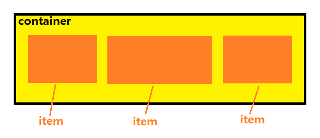
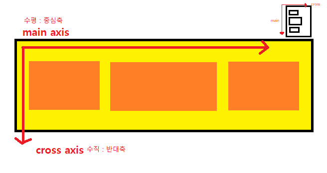
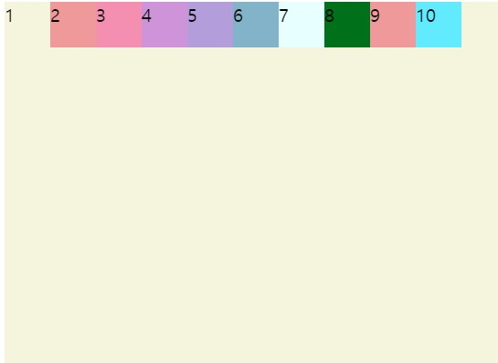
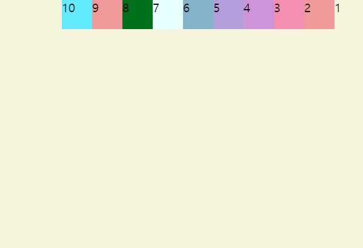
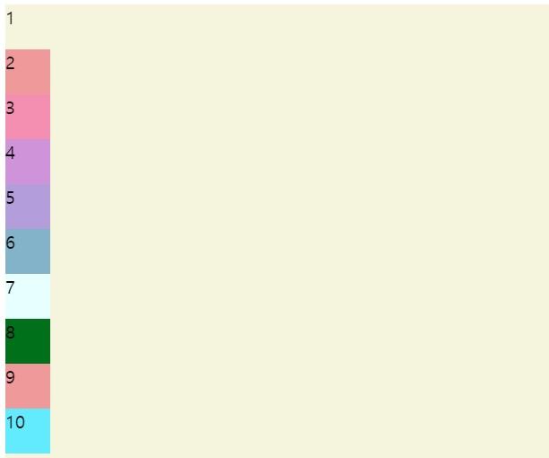
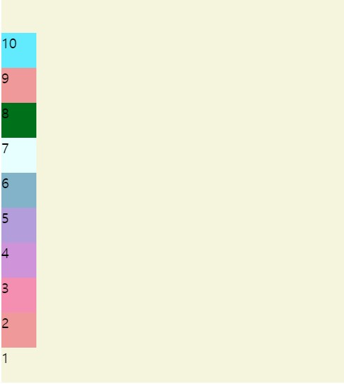
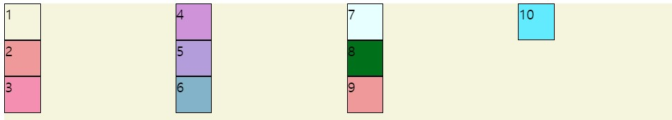
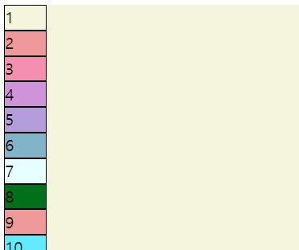
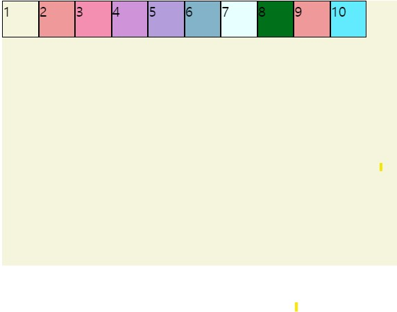
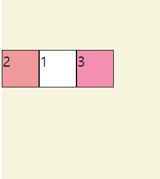

# CSS_3

FlexBox

## 1. FlexBox에는 박스에 지정하는 속성값들이 있고 그 박스 안에 들어가는 아이템도 지정되는 속성값들이 있다.

###  float 

이미지와 텍스트를 어떻게 배치 할 것인지 정의하기 위해 나왔다.(hack)

* `float : left` 이미지가 왼쪽으로 배치되고 택스트 들이 이미지를 둘러싼 형태.

* `float : center` 이미지가 중앙으로 배치되고 택스트 들이 이미지를 둘러싼 형태.

* `float : right`  이미지가 오른쪽으로 배치되고 택스트 들이 이미지를 둘러싼 형태.





### container 에 꾸릴수 있는 속성 값

```
display

flex-direction

flex-wrap

flex-flow

justify-content

align-items

align-content
```


### item에 지정할 수 있는 속성 값

```
order

flex-grow

flex-shrink

flex

align-self
```


## 2. 중심축과 반대 축이 있다.

아이템들이 수평으로 기준이 되서 만들어지면 수평이 main이 되고 수직이 기준이 되면 수직이 main이 된다.




<html>

```html
<!DOCTYPE html>
<html>
	<head>    
		<meta charset="utf-8">    
		<meta name="viewport" content="width=device-width">    
		<title>CSS3 DEMO</title>
	</head>    
    <body> 
        <div class="container">
            <div class="item item1">1</div> 
            <div class="item item2">2</div>
            <div class="item item3">3</div>
            <div class="item item4">4</div>
            <div class="item item5">5</div>
            <div class="item item6">6</div>
            <div class="item item7">7</div>
            <div class="item item8">8</div>
            <div class="item item9">9</div>
            <div class="item item10">10</div>					
        </div>
	</body>		
</html>

<!-- div.container>div.item.item${$}*10 -->
<!--$은 번호를 자동으로 지정하겠다. *10 열번 반복 -->
```

<css>

```css

.container{
	background:beige;
	height : 100vh;
}

.item{
	
}
.item2{
	background:#ef9a9a
}
.item3{
	background:#f48fb1;
}
.item4{
	background:#ce93d8;
}
.item5{
	background:#b39ddb;
}
.item6{
	background:#82b3c9;
}
.item7{
	background:#e6ffff;
}
.item8{
	background:#00701a;
}
.item9{
	background:#ef9a9a;
}
.item10{
	background:#62ebff;
}

```


* .container 의  **height : 100vh 와 100% 차이점 알기!**

**100%** : 컨테이너가 들어있는 부모 높이의 100% 로 채우겠다. (html > body > container ) 

<css>

```css
body, html{
    height:100%;
}

.container{
	background:beige;
	height:100vh%;
}

```


**100vh** 부모에 상관없이 아이템을 view for height 보여지는 페이지에서의 100% 다쓸때 사용.

<css>

```css
.container{
	background:beige;
	height : 100vh;
}
```


## 3. item조정

<css> 아이템의 폭과 넓이 조절

```css
.item{
	width:40px;
	height:40px;	
}
```


---------------------------------

* ### FlexBox 

<css> **display: flex** 플랙스 박스 임을 알려준다.

```css
.container{
	background:beige;
	height : 100vh;	
	display:flex;	
}
```




<css> flex-direction: **row**  기본값 왼쪽에서 오른쪽으로

```css
.container{
	background:beige;
	height : 100vh;	
	display:flex;
	flex-direction: row;
}
```


<css> flex-direction: **row-reverse** 오른쪽에서 왼쪽으로 (중심축:수평)

```css
.container{
	background:beige;
	height : 100vh;	
	display:flex;
	flex-direction: row-reverse;
}
```




<css> flex-direction: **column** 위에서 아래로 (중심축:수직)

```css
.container{
	background:beige;
	height : 100vh;	
	display:flex;
	flex-direction: column;
}
```




<css> flex-direction: **column-reverse** 아래서 위로 (중심축:수직)

```css
.container{
	background:beige;
	height : 100vh;	
	display:flex;
	flex-direction: column-reverse;
}
```





-----------------


### - flex-wrap 다음줄로 넘어가게 할 건지 안할건지

<css> 

flex-wrap:**wrap** 화면에 아이템이 꽉차면 다음 줄로 넘어가게

flex-wrap:**wrap-reverse**  꺼꾸로 반대로 다음 줄로 넘어가게

flex-wrap:**nowrap** 레핑안하고 화면사이즈에 맞춰 꽉맞게 다 나오게 해줌 

```css
.container{
	background:beige;
	height : 100vh;	
	display:flex;
	flex-direction: row;
	flex-wrap:wrap;
	
}
```


<css>  (flex-direction)+(flex-wrap) == flex-flow

* flex-flow: **column wrap**

```css
.container{
	background:beige;
	height : 100vh;	
	display:flex;
	flex-flow: column wrap;	
}
```




<css> flex-flow: **column nowrap**

```css
.container{
	background:beige;
	height : 100vh;	
	display:flex;
	flex-flow: column nowrap;	
}
```




------------------


###  - justify-content 아이템을 수평에서 어떻게 배치 할지 정해준다(중심축)

<css>

justify-content: **flex-start** 기본 왼쪽에서 오른쪽으로 배치 (수직의 경우에선 위에서 아래로 가 기본값)

```css
.container{
	background:beige;
	height : 100vh;	
	display:flex;
	flex-flow: row nowrap;	
	justify-content: flex-start;	
}
```



<css>

 justify-content:  **flex-end** 아이템 순서는 두고 오른쪽 정렬

justify-content:  **center** 아이템들 순서그대로 중앙 정렬

```css
.container{
	background:beige;
	height : 100vh;	
	display:flex;
	flex-flow: row nowrap;
	
	justify-content: flex-end;	
}
```


<css> 

 justify-content: **space-around** 박스를 둘러싸서 스페이스가 생겨 간격을 벌려준다. 

justify-content: **space-evenly** 박스끼리 모두 같은 간격으로 벌려준다

justify-content: **space-between** 양끝은 화면에 맞게 배치하고 중간에만 아이템을 넣어준다.

```css
.container{
	background:beige;
	height : 100vh;	
	display:flex;
	flex-flow: row nowrap;	
	justify-content: space-around;	
}

```


-----------------------


### - align-items 아이템을 수직에서 어떻게 배치할 것 인지 정해준다.(반대축)

<css> 수직기준 중앙배치

align-items: **center**

```css
.container{
	background:beige;
	height : 100vh;	
	display:flex;
	flex-flow: row wrap;	
	justify-content: center;
	
	align-items: center;
}

```


<css>

align-items: **baseline** 텍스트를 모두 균등하게 보여줘 

```css
.container{
	background:beige;
	height : 100vh;	
	display:flex;
	flex-flow: row wrap;	
	justify-content: center;	
	align-items: baseline;
}

.item1{
	background:#ffff;
	padding:20px;
}

```


------------------


<html>

```html
<!DOCTYPE html>
<html>
	<head>    
		<meta charset="utf-8">    
		<meta name="viewport" content="width=device-width">    
		<title>CSS3 DEMO</title>
	</head>    
    <body> 
        <div class="container">
            <div class="item item1">1</div> 
            <div class="item item2">2</div>
            <div class="item item3">3</div>
            <div class="item item4">4</div>
            <div class="item item5">5</div>
            <div class="item item6">6</div>
            <div class="item item7">7</div>
            <div class="item item8">8</div>
            <div class="item item9">9</div>
            <div class="item item10">10</div>
			
			<div class="item item1">1</div> 
            <div class="item item2">2</div>
            <div class="item item3">3</div>
            <div class="item item4">4</div>
            <div class="item item5">5</div>
            <div class="item item6">6</div>
            <div class="item item7">7</div>
            <div class="item item8">8</div>
            <div class="item item9">9</div>
            <div class="item item10">10</div>	
        </div>
	</body>		
</html>
```


<css> align-content: 반대축의 아이템을 지정한다.

```css
.container{
	background:beige;
	height : 100vh;	
	display:flex;
	flex-flow: row wrap;	
	justify-content: space-between;	
	align-items: baseline;
	align-content: 
}
```


<css>

align-content: **space-between** 수직으로 위아래 맞추고 중간에 스페이스 넣음.

align-content: **center** 중앙으로 모이게함

```css
.container{
	background:beige;
	height : 100vh;	
	display:flex;
	flex-flow: row wrap;	
	justify-content: space-between;	
	align-items: baseline;
	align-content:space-between; 
}
```


## 4. item 속성값

<html>

```html
<!DOCTYPE html>
<html>
	<head>    
		<meta charset="utf-8">    
		<meta name="viewport" content="width=device-width">    
		<title>CSS3 DEMO</title>
	</head>    
    <body> 
        <div class="container">
            <div class="item item1">1</div> 
            <div class="item item2">2</div>
            <div class="item item3">3</div>       
        </div>
	</body>		
</html>
```


<css>

```css
.container{
	padding-top:100px;
	background:beige;
	height : 100vh;	
	display:flex;
}


.item{
	width:40px;
	height:40px;
	border: 1px solid black;
}

.item1{
	background:#ffff;
	order:0;
}

.item2{
	background:#ef9a9a;
}
.item3{
	background:#f48fb1;
}
```


### - order 순서를 바꿀 수 있다.(현업에서 잘 쓰진 않음)

<css> item1-> 2번째 , item2->1번째, item3->3번쨰

```css
.item1{
	background:#ffff;
	order:2;
}

.item2{
	background:#ef9a9a;
	order:1;
}
.item3{
	background:#f48fb1;
	order:3;
}
```




### -  **flex-grow** 아이템이 공간을 채운다

<css> 

```css
.item1{
	background:#ffff;
	flex-grow:1;
}
```


<css> flex-grow:1 전체에 주면 전체가 같이 꽉채우며 움직인다

```css
.item1{
	background:#ffff;
	flex-grow:1;
}

.item2{
	background:#ef9a9a;
	flex-grow:1;
}
.item3{
	background:#f48fb1;
	flex-grow:1;
}
```


<css> 아이템1 에 **flex-grow:2**를 줘서 다른 애들보다 더 크게 차지하게 만들어줌 

```css
.item1{
	background:#ffff;
	flex-grow:2;
}

.item2{
	background:#ef9a9a;
	flex-grow:1;
}
.item3{
	background:#f48fb1;
	flex-grow:1;
}
```


### - flex-shrink: 컨테이너가 점점 작아질때 작아지는 비율을 높이는 것 

<css> 

아이템 1은 flex-shrink:2 씩 줄어들어 (창을 작게했을 때 2,3번에 비해 더 줄어든것을 볼수있다.)

```css
.item1{
	background:#ffff;
	flex-grow:2;
	flex-shrink:2;
}

.item2{
	background:#ef9a9a;
	flex-grow:1;
	flex-shrink:1;
	
}
.item3{
	background:#f48fb1;
	flex-grow:1;
	flex-shrink:1;
}
```


### - flex-basis 커지거나 작을때 영역차지하는 비율이 몇퍼센트인지 고정 해줌

<css> flex-basis : auto 기본값

**flex: 2 2 auto;**  해석  2(grow) 2(shrink) auto(basis);

```css
.item1{
	background:#ffff;
	flex-basis:60%;
}

.item2{
	background:#ef9a9a;
	flex-basis:30%;
	
}
.item3{
	background:#f48fb1;
	flex-basis:10%;
}

```


--------------------


### - align-self 컨테이너에서 벗어나서 아이템 별로 정렬 할 수 있다 

<css> align-self:center

```css
.item1{
	background:#ffff;
	flex: 2 2 auto;
	align-self:center;
}
```


[출처](https://youtu.be/7neASrWEFEM) 드림코딩by엘리 : CSS Flexbox 완전 정리

[color tool](https://material.io/resources/color/#!/?view.left=0&view.right=0) 색상표 사이트 
