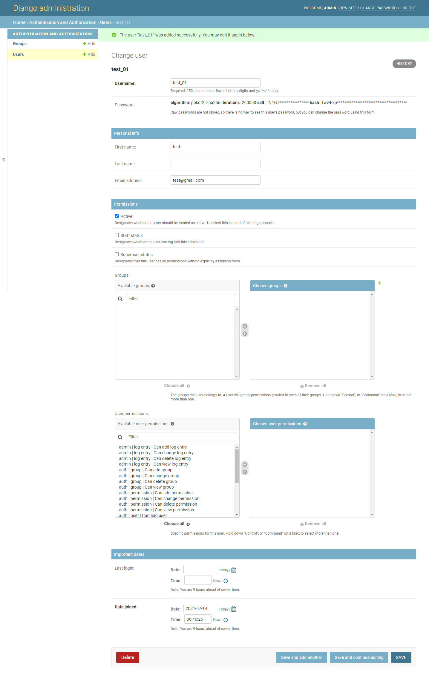

# DB Browser (database navigator )설치


**Terminal 명령어** 

`cls` =프로포트 화면 깨끗하게 만듬

`dir` = 디랙토리 확인 


**파이참에 Database Navigator 설치**

파이참에서 sqlite3 DB를 sql로 다루기 위해서는 'Database Navigator'라는 툴을 설치해야 한다. 설치하는 방법은 [설정]-[Plugin]에서 Database Navigator로 검색하면 된다. 설치하고 나면 플러그인을 실행하기 위해 재시작을 해야 한다.


-> 설치가 완료 된 후 파이참을 열고 왼쪽 바에 보면 project 밑에 DBbrowser확인 가능

# DB Browser 툴 사용법 

`+`  버튼을 눌러 SQLite를 실행해 준다


DB Navigator-Settings -> Database files 경로설정

1. sqlite.db 를 클릭하면 오른쪽 ... 생기고 이 부분을 클릭 하면 어느 위치의 db.sqlite3에 적용할 것인지

경로를 정하게 나온다. 이때 해당 프로젝트 안에있는 db.sqlite3를 선택하고 

2. Test connection 을 한다 이때 팝업으로 was successful 나오면 ok
3. ok 하면 연결 완료 


### db를 켜고 끄는 방법

`+`  Connection 을 우클릭하면 connect 와 disconnect가 있다.

connect가 활성화 되있으면 꺼 있는상태

disconnect가 활성화 되있으면 켜진 상태


### 메뉴

`+`Connection 의 consoles 의 connection 을 더블클릭해서 열어주면 sql문을 적용할 수 있는 창이 나온다. 

`+`Schemas


참고) Schemas 의 main 의 Tables가 없을때는 migrate 를 생성해야 한다. 

Terminals 에서 dir 확인해서 manage.py가 있는지 확인하고

migrate 생성 명령어를 입력한다 	`>` **python manage.py migrate**


# Tables 의 auth_user 로 로그인 관리 해보기

##  7. DB 와 SQL lite 

오늘의 목표 : 접근해서 값 가져와서, 화면에 디스플레이 하기

#### SQL lite 사용

Terminal 프로포트 깨끗하게 만들는 명령어 : **cls**

명령어 **dir** :  db.sqlite3 확인

파이참에서 sqlite쓰려고 database navigator 설치 

 ```
 파이참에서 sqlite3 DB를 sql로 다루기 위해서는 'Database Navigator'라는 툴을 설치해야 한다. 설치하는 방법은 [설정]-[Plugin]에서 Database Navigator로 검색하면 된다. 설치하고 나면 플러그인을 실행하기 위해 재시작을 해야 한다.
 ```

* 왼쪽 중간쯤 DB Browser 클릭 

  `+`버튼 누르고 sqlite클릭

화면 열리면 datapase files 의 sqlite클릭하면 오른쪽에 ... 클릭 

지금 하고있는 프로젝트  multi_django의 db.splite3 클릭 

경로 바뀐것 확인후 test connection 클릭 했을때 was successful하고 ok누르면 연결됨

connection 아래 consoles의 connection 열고

.help입력


* schemas 밑에 tables가 없을 땐 

migrate 생성해야해서 terminals에 dir확인해서 manage.py가  있는지 보고

migrate생성 명령어 입력한다  python manage.py migrate


* auth_user로 로그인 관리

쿼리 문을 직접 날려서 하자. 


* 열려있는 db끄기connection->desconnect


* 연결하기

**python manage.py createsuperuser**

Username: <u>**admin**</u>
Email address: **<u>admin@gamil.com</u>**
Password:
Password (again):
The password is too similar to the username.
This password is too short. It must contain at least 8 characters.
This password is too common.
Bypass password validation and create user anyway? [y/N]: **y**
Superuser created successfully.

runserver: http://127.0.0.1:8000/admin

하면 로그인창 뜨고 거기에 만든 admin넣으면됨 


-1626245197612.jpg)




-1626245427659-1626245437830.jpg)


connection 활성화 시키고

consoles -> connention 더블클릭해서 열고

schemas->auth_user 오른쪽 클릭 Extract SQL Statement-> Select statement

완료


엑셀 시트 같은것으로 표현 해보기 

terminal 로 업무창 열기: **python manage.py startapp polls**


* project에서 polls -> **models.py** 

  엑셀의 시트= 데이터베이스의  테이블 = 장고의 클래스

  클래스는 남의 기능을 흡수(상속)받을 수 있는 기능이 있다. (예: 다른 클래스 가져와서 내 추가기능 넣을수 있음)

```python
from django.db import models

# Create your models here.
class Question(models.Model):
    question_text = models.CharField(max_length=100)
    public_date = models.DateTimeField()
    votes = models.BigIntegerField()
```

-------


#### class->db에 넣기 

* web_config -> settings 

INSTALLED_APPS에 추가 : 의미) polls ->app.py안에 있는 polls사용 하겠다

```python
INSTALLED_APPS = [
    'django.contrib.admin',
    'django.contrib.auth',
    'django.contrib.contenttypes',
    'django.contrib.sessions',
    'django.contrib.messages',
    'django.contrib.staticfiles',
    'polls.apps.PollsConfig',
]
```

* terminal-> **python manage.py makemigrations polls**

```
Migrations for 'polls':
  polls\migrations\0001_initial.py
    - Create model Question
```

* polls-> migrations-> **0001_initial.py생성**이됨

```python
# Generated by Django 3.2.3 on 2021-07-14 08:34

from django.db import migrations, models


class Migration(migrations.Migration):

    initial = True

    dependencies = [
    ]

    operations = [
        migrations.CreateModel(
            name='Question',
            fields=[
                ('id', models.BigAutoField(auto_created=True, primary_key=True, serialize=False, verbose_name='ID')),
                ('question_text', models.CharField(max_length=100)),
                ('public_date', models.DateTimeField()),
                ('votes', models.BigIntegerField()),
            ],
        ),
    ]

```

auto_created=True  유니크한 값이다 . 


* spl문으로 바꾸기2

terminal -> python manage.py sqlmigrate polls 0001

```
CREATE TABLE "polls_question" ("id" integer NOT NULL PRIMARY KEY AUTOINCREMENT,
 "question_text" varchar(100) NOT NULL, "public_date" datetime NOT NULL, "votes
" bigint NOT NULL);
COMMIT;
```

* 준비 끝

  

동작

* 적용

**python manage.py migrate**

```
C:\Develops\multi_django>python manage.py migrate
Operations to perform:
  Apply all migrations: admin, auth, contenttypes, polls, sessions
Running migrations:
  Applying polls.0001_initial... OK
```


(아래는 0715 수정예정)

## select 문으로 유무 확인 

* schemas->  tables오른쪽 클릭 reload 하면 tables(12)가 됨

* polls_question->extract-> insert 

```
insert into polls_question (
values (
    time('now'),
    
    'what is ?',
    
    0)
;
```

* polls_question->extract-> select

-------------------------------------------


### 시작

Terminal -> **python manage.py createsuperuser**

```
Username: admin
Email address: admin@gamil.com
Password:
Password (again):
The password is too similar to the username.
This password is too short. It must contain at least 8 characters.
This password is too common.
Bypass password validation and create user anyway? [y/N]: y
Superuser created successfully.
```

* manage.py 런 시키기 

* browser : http://127.0.0.1:8000/admin

  하면 로그인창 뜨고 거기에 만든 admin넣으면됨 

  사이트에서 

* DBbrowser -> connection 오른쪽 클릭해서 활성화 시키고 -> consoles -> connention 더블 클릭 오른쪽에 열리면-> schemas의 auth_user 오른쪽 클릭 Extract SQL Statement-> Select statement 실행

완료


### 준비: DB browser에 `엑셀 시트`로 표현 해보기 

`엑셀 시트= 데이터베이스 테이블 = 장고 클래스`

1- 해당  파일(polls) 만들기 

* Terminal  ->  **python manage.py startapp polls**

* Python project root 에서 polls -> **models.py** 더블클릭 

  클래스는 남의 기능을 흡수(상속)받을 수 있는 기능이 있다.

   (예: 다른 클래스 가져와서 내 추가기능 넣을수 있음)

```python
from django.db import models

# Create your models here.
class Question(models.Model):
    question_text = models.CharField(max_length=100)
    public_date = models.DateTimeField()
    votes = models.BigIntegerField()
```


2- polls에 class -> DB에 넣기 

* web_config -> settings 

INSTALLED_APPS에 추가 : 의미) polls ->app.py안에 있는 polls사용 하겠다

```python
INSTALLED_APPS = [
    'django.contrib.admin',
    'django.contrib.auth',
    'django.contrib.contenttypes',
    'django.contrib.sessions',
    'django.contrib.messages',
    'django.contrib.staticfiles',
    'polls.apps.PollsConfig',
]
```

* Terminal-> **python manage.py makemigrations polls**

```
Migrations for 'polls':
  polls\migrations\0001_initial.py
    - Create model Question
```

* polls-> migrations-> **0001_initial.py생성**이됨

```python
# Generated by Django 3.2.3 on 2021-07-14 08:34

from django.db import migrations, models


class Migration(migrations.Migration):

    initial = True

    dependencies = [
    ]

    operations = [
        migrations.CreateModel(
            name='Question',
            fields=[
                ('id', models.BigAutoField(auto_created=True, primary_key=True, serialize=False, verbose_name='ID')),
                ('question_text', models.CharField(max_length=100)),
                ('public_date', models.DateTimeField()),
                ('votes', models.BigIntegerField()),
            ],
        ),
    ]

```

auto_created=True  유니크한 값이다 . 


* spl문으로 바꾸기2

Terminal -> **python manage.py sqlmigrate polls 0001**

```
CREATE TABLE "polls_question" ("id" integer NOT NULL PRIMARY KEY AUTOINCREMENT,
 "question_text" varchar(100) NOT NULL, "public_date" datetime NOT NULL, "votes
" bigint NOT NULL);
COMMIT;
```


### 동작 : DB browser에 `엑셀 시트`로 표현 해보기 

* 적용

Terminal -> **python manage.py migrate**

```
C:\Develops\multi_django>python manage.py migrate
Operations to perform:
  Apply all migrations: admin, auth, contenttypes, polls, sessions
Running migrations:
  Applying polls.0001_initial... OK
```


### select 문으로 유무 확인 

* schemas->  tables오른쪽 클릭 reload 하면 tables(12)가 됨

* polls_question->extract-> insert 

```
insert into polls_question (
values (
    time('now'),
    
    'what is ?',
    
    0)
;
```


* polls_question->extract-> select


# 실전 적용: DB -> EXCELL로 담기

1. [제목,링크](http://media.daum.net/economic/) 스크레핑 해서 데이터 베이스에 담기

2. 고전적 리퀘스트 가져오기로 함 

root에 scrapping 폴더에 daum_economic_scrapping.py 생성

```python
from bs4 import BeautifulSoup
import requests

res = requests.get('http://media.daum.net/economic/')

if res.status_code == 200 : #200정상
    soup = BeautifulSoup(res.content,'html.parser') #content해석하는 parser사용하는것을 뷰티플솝에 담아 변수에넣음
    links = soup.find_all('a', class_= 'link_txt')#a테그 가져오는데 class의 특정부분만 뺴올거야'a.link_txt'
    for link in links: #links에서 link를빼냄
        title= link.get_text() #테그의 성격을가진 것을 title로 뺌
        href = link.get('href')
        print(title,':', href)
```


* 잘 작동하는지 확인 (어떻게 작동하는지  보면 됨 생략가능)

**debug concole** 

`>>>` type(res) |  형태가 리퀘스트인 것 확인 가능

`>>>` res.status_code | 200 확인

F9 누르면서 어떻게 돌아가고 있는지 확인 

`>>>` type(soup) | BeautifulSoup

      해석안된 부분은 error나옴

`>>>` type(links) |  bs4.element.ResultSet

`>>>` links[0] | list 에서 값을 뽑을 때

다시 디버깅

`>>>` len(links) | 135개 들어온것 확인 가능

최종 수정 

```python
from bs4 import BeautifulSoup
import requests

res = requests.get('http://media.daum.net/economic/')

if res.status_code == 200 :
    soup = BeautifulSoup(res.content,'html.parser')
    links = soup.find_all('a', class_='link_txt')
    for link in links:
        title= str.strip(link.get_text())
        href = str.strip(link.get('href'))
        print(title,' : ', href)
```


3. db에 데이터베이스가 models

   polls -> models.py 

   여기에 들어간 class(레코드(행),컬럼(열))는 테이블이다

   ```python
   from django.db import models
   
   # Create your models here.
   class Question(models.Model):
       question_text = models.CharField(max_length=100)#column(변수),datatype
       public_date = models.CharField(max_length=100) #소수점은 DateTimeField, 문자는 CharField
       votes = models.DecimalField(max_digits=20,decimal_places=10) #BigIntegerField
   
   class Economics(models.Model): # Model상속받아 기능을 향상시킴
       title = models.CharField(max_length=100)#컬럼 이름title은 성격이 str이라
       href = models.CharField(max_length=100) # href성격이 link 고 str이라
       creat_date = models.CharField(max_length=100)#두 날짜 계산해야 할 때 DateTimeField사용
   ```


DB는 해당하는 업무에 맞게 만들어줘야하나 polls에 넣어 만듬

Terminal  -> **python manage.py makemigrations polls**

```
Migrations for 'polls':
  polls\migrations\0002_auto_20210715_1023.py
    - Create model Economics
    - Alter field public_date on question
    - Alter field votes on question
```


Terminal  -> **python manage.py sqlmigrate polls 0002**

```
DROP TABLE "polls_question";
ALTER TABLE "new__polls_question" RENAME TO "polls_question";
COMMIT;
```


Terminal  -> **python manage.py migrate**

```
C:\Develops\multi_django>python manage.py migrate
Operations to perform:
  Apply all migrations: admin, auth, contenttypes, polls, sessions
Running migrations:
  Applying polls.0002_auto_20210715_1023... OK

```


db browser에 tables 를 reload 하면 지금까지 (13) 됨 

polls_economics


#### 1접근하는방법(root에 db.sqlite3 에 모든 파일이 저장 됨)

daum_economic_scrapping.py 

```python
from bs4 import BeautifulSoup
import requests

res = requests.get('http://media.daum.net/economic/')

import splite3

if res.status_code == 200 :
    soup = BeautifulSoup(res.content,'html.parser')
    links = soup.find_all('a', class_='link_txt')
    for link in links:
        title= str.strip(link.get_text())
        href = str.strip(link.get('href'))
        print(title,' : ', href)
        connect = sqlite3.connect('./db.sqlite3')#db와 connection하고
        cursor = connect.cursor() # 커서로 현재 위치 잡아내야해
        #이제 테이블에 지정하고 인서트 딜리트 셀렉트 업데이트 할수있음
```


db에  Connection 더블클릭 후 polls_economic 인서트랑 셀렉트 작동하는지 확인 

```
insert into polls_economics (
    create_date,
    href,
    title)

values (
    datetime('now'),
    'www.google.com',
    '구글')
;
---------------------------------------
select
    pe.create_date,
    pe.href,
    pe.id,
    pe.titel
from
    polls_economics pe;

```


daum_economic_scrapping.py 에 적용

```python
from bs4 import BeautifulSoup
import requests

res = requests.get('http://media.daum.net/economic/')

import splite3

if res.status_code == 200 :
    soup = BeautifulSoup(res.content,'html.parser')
    links = soup.find_all('a', class_='link_txt')
    for link in links:
        title= str.strip(link.get_text())
        href = str.strip(link.get('href'))
        print(title,' : ', href)
        connect = sqlite3.connect('./db.sqlite3')#db와 connection하고
        cursor = connect.cursor() # 커서로 현재 위치 잡아내야해
        #이제 테이블에 지정하고 인서트 딜리트 셀렉트 업데이트 할수있음
        cursor.execute("insert into polls_economics(create_date,href,title)values(datetime('now'),"+href+","+title+")")
    connect.commit()
```


# static query방식으로 하는 방법 

에러 처리하는 방법 1(단순에러처리)

```python
from bs4 import BeautifulSoup
import requests

res = requests.get('http://media.daum.net/economic/')

import splite3


if res.status_code == 200:
    soup = BeautifulSoup(res.content, 'html.parser')
    links = soup.find_all('a', class_='link_txt')
    connect = sqlite3.connect('./db.sqlite3')
    cursor = connect.cursor()

    for link in links:
        title = str.strip(link.get_text())
        href = str.strip(link.get('href'))
        print(title, ' : ', href)
        try:
            cursor.execute(
                "insert into polls_economics(create_date, href, title) values(datetime('now'), ?, ?)",
                           (href, title))
        except:
            pass
        print(title, ' : ', href)
    connect.commit()
```


1. db설정 

dbbrowser에서

connection 을 connect시키고

console 및 connection 더블클릭해서 열어두고

tables 및 polls_economics의 SQL문 SELECT 불러오기

SELECT문 플레이 

debug 창 console 에 내용나오는지 확인 

connect 단축 connection 클릭

connection 오른쪽마우스클릭 autocommit

값확인 


2. 디스플레이 설정  


terminal - > python manage.py startapp board

board -> views.py

```python
from django.shortcuts import render

# Create your views here.
import sqlite3

def list(request):
    result = dict()
    conn = sqlite3.connect('db.sqlite3')
    curs= conn.cursor()
    curs.execute('select * from polls_economics pe')
    data = curs.fetchall() #몽땅 뱉어내는 작업을 변수 data에 담음
    return render(request, 'board/list.html', result)
```


web_config-> urls.py

```python
from django.contrib import admin
from django.urls import path
from home import views
from maps import views as mapsviews #views라는 이름이 중복될까봐 이름을 정해줌
from board import views as boardviews

urlpatterns = [
    path('admin/', admin.site.urls),
    path('home',views.index),
    path('',views.index),
    path('index01',views.index01),
    path('index02',views.index02),
    path('maps/home',mapsviews.home),
    path('board/list',boardviews.list),


```


board -> views.py

```python
from django.shortcuts import render

# Create your views here.
import sqlite3

def list(request):
    result = dict()
    conn = sqlite3.connect('db.sqlite3')
    conn.row_factory = sqlite3.Row #컬럼 사용하게해줘
    curs= conn.cursor()
    
    #economics
    curs.execute('select * from polls_economics pe')
    data = curs.fetchall()
    for row in data :
        print(row['title'],':',row['href'])
    result['erows'] = data
    return render(request, 'board/list.html', result)
```


#### 브라우저에 출력

templates -> board-> list.html

{{}} :변수만 기술

 :구문만 기술

<tr></tr>: 레코드 를 감쌀 수  있어

```html
<!DOCTYPE html>
<html lang="en">
<head>
    <meta charset="UTF-8">
    <title>Title</title>
</head>
<body>
    <table border="1">
        <!--header-->
        <tr>
            <th>Title</th>
            <th>Link</th>
        </tr>
        <!--content-->
        
        <tr>
            <td>{{row.title}}</td>
            <td>{{row.href}}</td>
        </tr>
        
    </table>
</body>
</html>
```


#### 위의 것을 간추린 차트

db browser -> main->auth_user->Select 문 실행

board->views.py

#user

```python
from django.shortcuts import render

# Create your views here.
import sqlite3

def list(request):
    result = dict()
    conn = sqlite3.connect('db.sqlite3')
    conn.row_factory = sqlite3.Row #컬럼 사용하게해줘
    curs= conn.cursor()

    #economics
    curs.execute('select * from polls_economics pe')
    data = curs.fetchall()
    for row in data :
        print(row['title'],':',row['href'])
    result['erows'] = data


    #user
    curs.execute('select * from auth_user au')
    result['members']=curs.fetchall()
    for row in result['members']:
        print(row['username'],':',row['email'])

    return render(request, 'board/list.html', result)
```


templates-> board->list.html

```html
<!DOCTYPE html>
<html lang="en">
<head>
    <meta charset="UTF-8">
    <title>Title</title>
</head>
<body>
    <h2>Members</h2>
    <table border="1">
        <!--header-->
        <tr>
            <th>username</th>
            <th>email</th>
        </tr>
        <!--content-->
        
        <tr>
            <td>{{row.username}}</td>
            <td>{{row.email}}</td>
        </tr>
        
    </table>


    <h2>economics</h2>
    <table border="1">
        <!--header-->
        <tr>
            <th>Title</th>
            <th>Link</th>
        </tr>
        <!--content-->
        
        <tr>
            <td>{{row.title}}</td>
            <td>{{row.href}}</td>
        </tr>
        
    </table>
</body>
</html>
```


# db.sqlite3 파이참에서 커밋 푸시<br>
db.sqlite3 정리해서 푸시하려는데 깃에 올라와있는 싱크와 안맞아서 충돌날 경우<br>
dbbrowser에서 disconnection 시키고 `+`sqlite를 만든다  <br>
경로는 새로 만든 db_06.sqlite3선택  <br>
connection활성화 시키고 console및 connection1을 더블클릭 <br>
셀렉트문 만듬  <br>

```
insert into dbapp_economic (
    id,
    create_date,
    href,
    title)
values (
    ':id',
    ':create_date',
    ':href',
    ':title')
;
```

재생 후 커밋푸시

