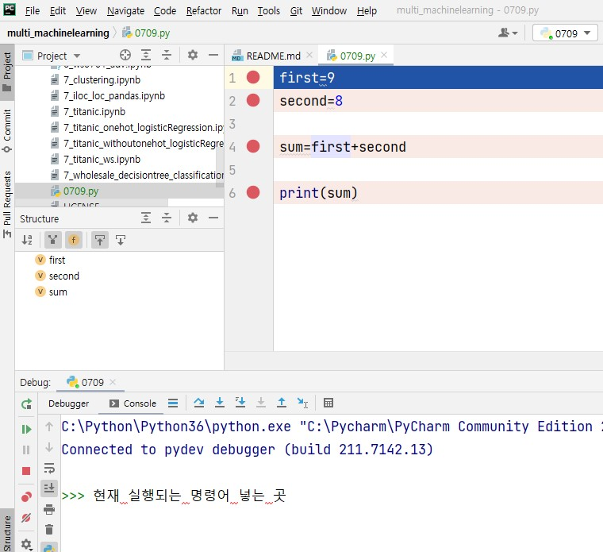
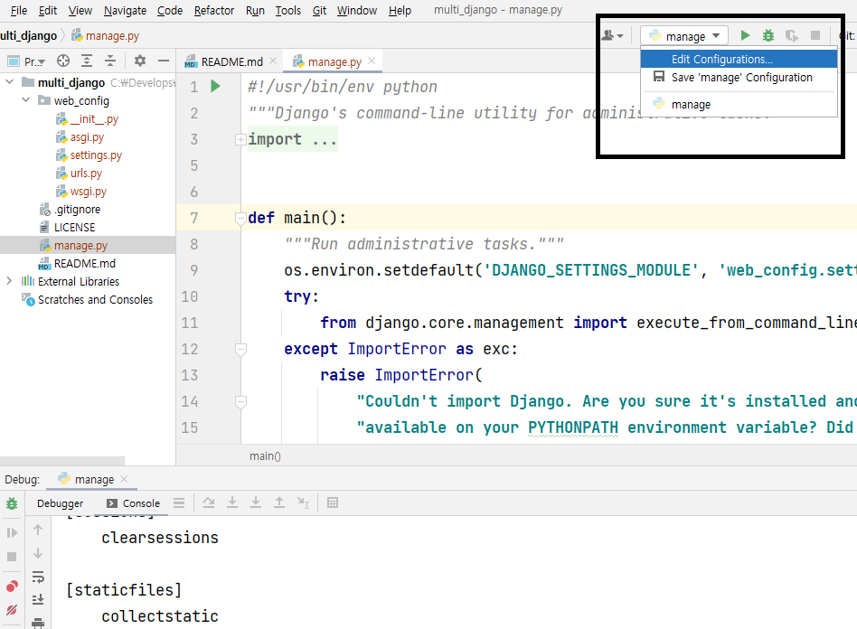

# github & pycharm clone 

VCS -> Get from Version Control 

사진 속 노랑색:  git repository url code입력

사진 속 분홍색: 내 컴퓨터 어느 위치에 clone할건지 위치선택


multi_django 는 route 이고 `,` manage.py 는 .git 과 유사하다

Terminal - **django-admin startproject web_config ./**


----------


# Debuging mode

multi_machinelearning 새로 오픈한다

route(multi_machinelearning)에 new python file(0709.py) 생성

0709.py

```python
first=9
second=8

sum=first+secon
```

* Debuging mode 사용

궁금한 부분보려면 break point건다(사진: 빨간 점 부분)

ctrl+shift+F10 -> run

ctrl+shift+F9  -> debuging mode open

F9 -> 다음 break point 로 넘어감



위에 (현재 실행되는 명령어 넣는 곳) 부분에 변수넣으면 print없이도 출력 됨 


```python
def sum(f,s):
    result= f + s
    return result

first=9
second=8

sum = sum(first,second)
```

----------


# django 의 manage.py를 debuging mode 실행


역할

manage.py 는 중계기 역할을 한다(환경파일로 토스하는 역할)


실행하는 방법

manage.py 를 실행하는 방법은 크게 두가지가 있다 

1. run

2. debug


manage.py를 실행시키려면 아래와 같이 한다.

  



검은상자 안 파란 부분 클릭


분홍부분에 runserver넣고 ok


노란부분 http://127.0.0.1:8000/ 누르기


----------

# startapp (웹서버 브라우저 만들기)

Terminal - **python manage.py startapp home**


multi_django `>` home `>` views 


상황:

클라이언트(uri)가 요청(request)하면 변수request(ip와 정보)로 받아서 웹서버(html)에 던저준다(manage.py).

날아온 것을 가지고 웹서버는 어디에있는지 찾아서 끄집어내서 다시 클라이언트에게 응답response해준다. 

이때, 웹서버가 끄집어낸 것을 상대가 보기 편하게 변경시키고 보내줘야한다.

클라이언트가 이해하기 편하게 HTML, CSS,JAVA같은거로 보기쉽게 바꿔서 네트워크로 보내준다.


## views.py 의 역할

uri가 해당 펑션을 요청한다. veiws에서는 기능별로 분리하기 편하게 펑션을 사용해준다


```python
from django.http import HttpResponse

def index(request):
    path=request.path
    resultstr=''
    if path =='/home':
        resultstr='<h1>여기는 home 입니다.</h1>'
    else: 
        resultstr= '<h1>d여기는 main 입니다.</h1>'
    return HttpResponse(resultstr)
```

해석:

def 펑션에 담은 index를 불러줘 클라이언트가 요청한거를 `(request)`로 받았다. 

클라이언트 잘보라고 html 로 만들어주고  resultstr 을 리턴받는다 

응답해줄땐 HttpResponse을 써.


## web_config `>` urls.py 역할

구분자. `,` 어느 평션을 찾아가야 할지 힌트 주는 곳

```python
from django.contrib import admin
from django.urls import path
from home import views

urlpatterns = [
    path('admin/', admin.site.urls),
    path('',views.index),
    path('home',views.index)
]
```

해석:

`from home import views` 나 `views`사용 할게 

` path('home',views.index)`

이쪽 uri `'home'` 를 저쪽 `index` 에 보내줘`path`. 

`->` uri 인 127.0.0.1:8000와 127.0.0.1:8000/home 이 'home' 으로 들어가게 됨 


views.py에서 breakpoint 부분실행해주면 브라우저화면에 `'<h1>안녕하세요. 김주희 입니다.</h1>'`뜨게된다.


## web_config `>` settings.py 역할

여기에는 대부분 환경설정 내용이 다 들어있다 


설정:

ALLOWED_HOSTS uri를 누구나 다 사용할 수 있게 설정 `*`

TEMPLATES 연동했다고 써주기 `'DIRS':[os.path.join(BASE_DIR,'templates')],`

```python
ALLOWED_HOSTS = ['*']

TEMPLATES = [
    {
        'BACKEND': 'django.template.backends.django.DjangoTemplates',
        'DIRS': [],
        'DIRS':[os.path.join(BASE_DIR,'templates')],

```


## route(project)에 templates `>` index.html 생성

```html
<!DOCTYPE html>
<html lang="en">
<head>
    <meta charset="UTF-8">
    <title>Title</title>
</head>
<body>
<h1>여기는 index입니다 </h1>>
</body>
</html>
```


## views.py 에 index01 추가 

클라이언트에게 가는게 아니라 내부 애한테 보내는거라 render 씀 

렌더링 하는 html에서 변수를 골라 쓸 수 있어


```python
def index01(request):
    result = {'first':'juhee',
              'second':'kim'
              }
    return render(request, 'index.html',context=result)
```

해석:

context : html을 다이네믹 하게 변경시켜주는 변수


## index.html 사용


```html
<!DOCTYPE html>
<html lang="en">
<head>
    <meta charset="UTF-8">
    <title>Title</title>
</head>
<body>
    <h2>{{first}} {{second}}</h2>
    <h1>여기는 index입니다 </h1>>
</body>
</html>
```

해석:

변수이름을 딕셔너리에 담아 표현해줌 {{}}


## urls 에 index02 추가

```html
urlpatterns = [
    path('admin/', admin.site.urls),
    path('',views.index),
    path('home',views.index),
    path('index01',views.index01)
]
```


#  get방식 , post방식으로 보내기


## views.py에 index02 추가

get은 클라이언트가 보내온 값을 가지고 내부에서 쓸수잇게 함 

```python
def index02(request):    
    result = {'first':request.GET['first'],'second':request.GET['second']}
    return render(request, 'index.html',context=result)
```

## urls.py에 index02 추가

```python
urlpatterns = [
    path('admin/', admin.site.urls),
    path('',views.index),
    path('home',views.index),
    path('index01',views.index01),
    path('index02',views.index02)
]
```

----------


# pycharm에서 python 작업 한 것 github 에 commit 할 때 환경파일 올라가지 않게 설정

unversioned Files > .gitignore 오픈

환경파일인  `.idea/*.xml` `.idea/*.iml`  추가해서 해당확장자 커밋되지 않도록 하고 연필모양 눌러서 저장


.py 파일들과 .gitignore 만 체크하고 commit push


## Github로 이동

commit push 잘됫는지 확인 

이것을 제 3자가 볼수있게 **goorm사용**


Terminal - **python manage.py migrate**


----------


# Goorm 사용 

## Goorm 과 Github 연동

- IDE클릭

  - 대시보드 클릭

    - 컨테이너

      - 새컨테이너

        - 이름: multidjango 입력

        - 공개범위: Private 선택

        - 템플릿: Github 선택

        - Github 인증하기

        - Authorize goorimist 클릭

        - 깃의 레포지토리  볼수잇음 거기서 multi_django 선택

        - 소프트웨어 스팩: 장고  선택

        - 만들기 클릭 

          
----------


# NET 네트워크의 이해

## port 란 무엇인가?

* 준비

    * CMD 창 3개 오픈 ,탐색기 창 1개오픈
    
    * Develops폴더 안에 port_test폴더 만들고

   note01, note02,note03 folder생성하고

  각 폴더에 test01,test02,test03  txt문서 만들어 넣기

* CMD


    * 창1

cd C:\Develops\port_test\note01

jupyter notebook --port=7775


    * 창2

cd C:\Develops\port_test\note02

jupyter notebook --port=7776


    * 창3

cd C:\Develops\port_test\note03

jupyter notebook --port=7777


    * 창4 

jupyter notebook --port=7777


** 결과: port는 서버띄울때 --port=값 , 포트 값이 같은것은 쓸수 없다 . 창4는 자동으로 7778로 되서 사용가능.**


한정된 아이피를 각 컴퓨터에 부여할수 없기 때문에, 내부적인 아이피 즉 가상 아이피를 부여해 특정 공간안에서 사용가능하게 만들어 두었다. (hub, router-wifi)


내가 쓰고있는 컴터 ip 확인 방법은 cmd에서 ipconfig하면 IPv4 주소 . . . . . . . . . : 172.30.1.33 확인가능


외부사람이 내 서버에 접속하게 만들려면 브라우저에서 사용되는 myip주소를 확인해서 알려주어야 한다. 

## 파일 위치 찾기(상대경로 , 절대경로)

루트에 폴더 1 안에 폴더 2 안에 파일a가 있다.

../../폴더 2/ 파일a

----------


# web server (프론트 & 백엔드)


## 요청테그에 대해 배워봅시다.

브라우저에 요청 하는 테그이다.

1. a테그 `<a href=""></a`

2. form 테그  `<form action=""></form>`

3. ajax 테그

   


## 준비

web_config-> urls.py

```python
urlpatterns = [
    path('admin/', admin.site.urls),
    path('home',views.index),
    path('',views.index),
    path('index02',views.index02),

#웹서버에 값 던지기
]
```


home->views.py 사용할 변수 index02,index

```python
from django.shortcuts import render

# Create your views here.

from django.http import HttpResponse

def index(request):
    path=request.path
    resultstr=''
    if path =='/home':
        resultstr='<h1>여기는 home 입니다.</h1>'
    else:
        resultstr= '<h1>여기는 김주희 입니다.</h1>'
    return HttpResponse(resultstr)

def index02(request):

    return render(request,'index_copy.html')
```


templates->index_copy.html

```html
<!DOCTYPE html>
<html lang="en">
<head>
    <meta charset="UTF-8">
    <title>Title</title>
</head>
<body>
    <h1>여기는 index_copy입니다 </h1>
    <a href=""></a>
    <form action=""></form>
</body>
</html>
```


manage.py 디버깅 스타트


## 테그의 동작 

## a 테그 : url만 사용하고 싶을 때 사용

templates->index_copy.html

```html
<!DOCTYPE html>
<html lang="en">
<head>
    <meta charset="UTF-8">
    <title>Title</title>
</head>
<body>
    <h1>여기는 index_copy입니다 </h1>
    <a href="home">홈페이지로 이동</a>    
</body>
</html>
```


### form 테그: url 뿐 아니라 세부적인 값을 사용 하고 싶을때 사용

templates->index_copy.html

```html
<!DOCTYPE html>
<html lang="en">
<head>
    <meta charset="UTF-8">
    <title>Title</title>
</head>
<body>
    <h1>여기는 index_copy입니다 </h1>    
    <a href="home">홈페이지로 이동</a>
    <form action="/home">
        <input type="text" name="first">
        <input type="text" name="second">
        <input type="text" name="third">
        <input type="submit" name="press">
    </form>
<!--form은 submit있어야만 동작-->
</body>
</html>
```


### 인풋에 넣은 값을 리퀘스트에 담기 

name이 구분자가 되는데 이건 리퀘스트와 인풋 연결로 쓰인다 


웹브라우저에서 넣은 값이 잘 들어왔는지 확인하려면 

Debug console`>>>` **request.GET['first','second','third']** 

입력값 	`첫번째, two , 세번째`	 확인가능 


db, excel에 연결해서 렌더링으로 넘겨서 쓸 수 있다. 


## 한페이지에 해당부분 달리 사용하려면 form문을 따로써주면 됨

### 검색창

url-> 서치

### 입력창

url->인서트 


```html
<h2>검색창</h2>
    <form action="/home">
        <input type="text" name="search">
        <input type="submit" name="press">
    </form>
<!--form은 submit있어야만 동작-->
    <h2>입력창</h2>
    <form action="index01">
        <input type="text" name="first">
        <input type="text" name="second">
        <input type="text" name="third">
        <input type="submit" name="press">
    </form>
```


## method 설정

get 변수의 값을 누구나 다보게하는(form은 기본이 get으로 되있음 )

post 변수의 값을 못보게 할 경우는 보안설정해줘야한다.

보안: ``  설정해주면 페이지 열릴때마다 키 번호 바뀜

```python
h2>입력창</h2>
    <form action="/index01" method="post">
        
        <input type="text" name="first">
        <input type="text" name="second">
        <input type="text" name="third">
        <input type="submit" name="press">
    </form>
```


웹브라우저에서 보내준 값 못보게 하려면 

Debug console`>>>`**request.POST['second']**

